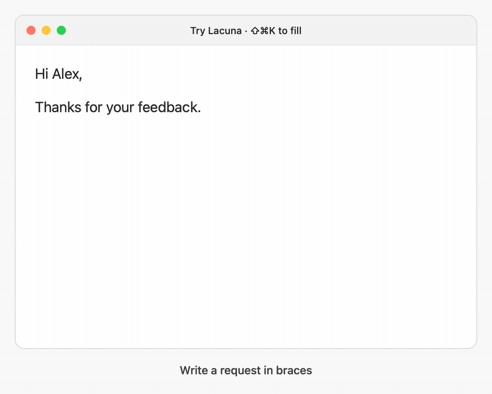

# Lacuna

Fill the gaps in your writing. Lacuna is an open source macOS menu bar app that turns `{instructions}` into three inline suggestions, wherever compatible text fields are available.



*Example workflow using Lacuna’s native UI and sample suggestions.*

## Requirements

macOS 13 or later, Apple Silicon or Intel, and an OpenAI or Anthropic API key (or an OpenAI-compatible server).

## Install

Download the DMG or ZIP from [GitHub Releases](https://github.com/jdamon96/lacuna/releases), move Lacuna to Applications, and open it. Preview downloads are ad-hoc signed, without Apple Developer ID signing or notarization. macOS may require you to allow the app in **System Settings → Privacy & Security → Open Anyway** after the first launch attempt.

Grant **Accessibility** access when prompted, then open Lacuna’s menu bar settings. Choose your provider, enter your API key, and select a model from the dropdown. **Refresh** loads the available OpenAI or Anthropic models using your key. You can also enter a model ID manually, including for custom servers. Click **Save** when ready.

From version 0.3.0, choose **Check for Updates…** in Lacuna’s menu to download, install, and relaunch in place. **Check for updates automatically** enables background checks; automatic checks and installation are opt-in. Updates preserve your settings and Keychain entries. Versions 0.2.x need one manual installation to get the updater.

## Use

1. Type something like `Let’s meet {a friendly way to suggest next Tuesday}.`
2. Keep that text field focused. All completed phrases are highlighted, and a subtle underline marks an unfinished opening `{`. If an app exposes the text but not its character positions, Lacuna outlines the field and shows a phrase count instead.
3. Press **⇧⌘K** to generate three options for the earliest brace phrase in the field. Its outline and the popup’s phrase counter show which phrase is active.
4. Press **1**, **2**, or **3** to replace it. Lacuna then generates options for the next phrase, using your accepted wording as context. **Escape** stops the sequence and leaves the remaining phrases untouched.

Use **↑/↓** to scroll long suggestions, **Tab** to move to the next option, and **Return** to accept the selected option. Reopening an unchanged template brings back its previous options. Press **⌘R** in the popup for new suggestions, or **⌘C** to copy the selected option. If insertion fails, the options stay open.

Use single braces. You can change the shortcut, provider, and model in settings. OpenAI and Anthropic use their respective native APIs. Choose **OpenAI-compatible** to configure a custom or local server with a Chat Completions API.

## Privacy and compatibility

Brace detection happens locally in the focused text field. Text is sent directly to your configured provider only when you request suggestions. API keys stay in macOS Keychain. The last 20 sets of suggestions are kept in memory until you quit or save settings; prompts and suggestions are never saved to disk. There is no Lacuna server or analytics.

Updates use [Sparkle](https://sparkle-project.org/) and GitHub, with signed release metadata and archives verified before installation. Update checks do not send your editor text or API keys; system profiling is disabled.

Lacuna uses macOS Accessibility APIs. Exact phrase highlights require character positions; the field indicator requires editable text and field bounds. Apps that expose neither cannot support these cues. Read-only pages and secure password fields are excluded. For a problem input, focus it and choose **Inspect text field…** in Lacuna’s menu to view a compatibility report. The report contains capabilities and counts, not your text; nothing is sent automatically.

## Build from source

Install [Xcode Command Line Tools](https://developer.apple.com/xcode/resources/) with Swift 5.9 or later, then:

```sh
git clone https://github.com/jdamon96/lacuna.git
cd lacuna
./scripts/install.sh
```

This builds, installs to `~/Applications`, and opens Lacuna. Use `./scripts/build.sh` to build only, `swift test` to run tests, or `./scripts/release.sh` to create a universal DMG and ZIP in `dist/` (requires full Xcode).

Release scripts default to version `0.4.1`, build `8`; override them with `--version` and `BUILD_NUMBER`. Releases require the Sparkle signing key; ordinary builds do not. See [Publishing releases](docs/RELEASING.md) for signing and updating the feed. Nothing is published automatically.

## License

[MIT](LICENSE). Built with Swift and AppKit.
